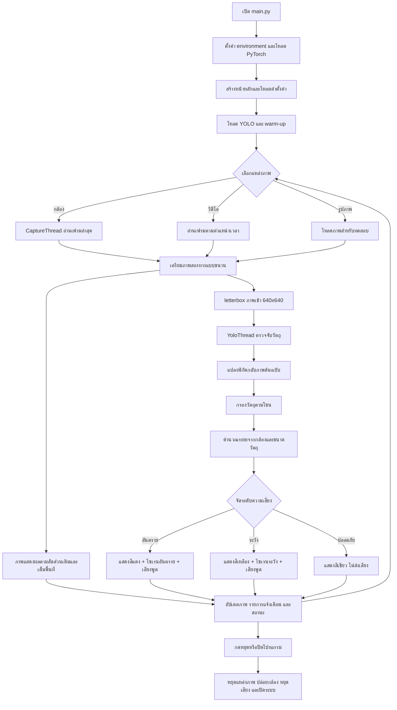

# Third Eye

Third Eye เป็นโปรแกรมตรวจจับวัตถุบนถนนจากกล้อง วิดีโอ หรือรูปภาพ โดยใช้ YOLO ประเมินระยะ แบ่งระดับความเสี่ยงเป็น **อันตราย / ระวัง / ปลอดภัย** และแจ้งเตือนด้วยไซเรนกับเสียงพูดภาษาไทย

เอกสารนี้อธิบายวิธีติดตั้ง วิธีควบคุมทุกส่วน และลำดับการทำงานของโปรแกรมแบบเข้าใจง่าย

## 1. เริ่มใช้งานบน Windows

เปิด PowerShell ในโฟลเดอร์โปรเจกต์ แล้วใช้คำสั่ง:

```powershell
cd C:\CS3\project\pg
.\cvce\Scripts\Activate.ps1
python main.py
```

ถ้า PowerShell ไม่อนุญาตให้เปิด environment ให้ใช้คำสั่งนี้เฉพาะหน้าต่างปัจจุบัน:

```powershell
Set-ExecutionPolicy -Scope Process -ExecutionPolicy Bypass
.\cvce\Scripts\Activate.ps1
python main.py
```

ตรวจสอบว่าใช้ Python ของโปรเจกต์:

```powershell
where.exe python
python --version
```

ผลของ `where.exe python` ควรมีบรรทัดนี้อยู่ด้านบน:

```text
C:\CS3\project\pg\cvce\Scripts\python.exe
```

ถ้าไม่มี `cvce` หรือ environment เสีย ให้สร้างใหม่และติดตั้งแพ็กเกจ:

```powershell
py -3.11 -m venv cvce
.\cvce\Scripts\Activate.ps1
python -m pip install -r requirements.txt
python main.py
```

## 2. ควบคุมระบบจากหน้าหลัก

| ปุ่มหรือส่วนควบคุม | หน้าที่ |
|---|---|
| **เปิดกล้อง** | เปิดกล้องตาม index ภายในระบบ (ค่าเริ่มต้น `0`) แล้วเริ่มตรวจจับต่อเนื่อง |
| **หยุด** | หยุดกล้องหรือวิดีโอ ถอดแหล่งเฟรมออกจาก worker ตรวจจับ และหยุดเสียงที่กำลังเล่น โดยยังเก็บ worker โมเดลไว้พร้อมใช้ |
| **เปิดวิดีโอ** | เลือกไฟล์วิดีโอเพื่อให้ระบบตรวจจับ วิดีโอสามารถลากแถบเวลาเพื่อข้ามช่วงได้ |
| **เปิดรูปภาพ** | เลือกรูปภาพหลายไฟล์เพื่อทดสอบทีละภาพ มีปุ่มภาพก่อนหน้า/ถัดไป |
| **บันทึกผล** | ส่งออกภาพที่มีกรอบตรวจจับและไฟล์ CSV หลังทดสอบรูปภาพ |
| **เสียงแจ้งเตือน** | ปิดหรือเปิดเสียงแจ้งเตือนชั่วคราวจากหน้าหลัก โดยไม่เปลี่ยนค่าที่บันทึกในตั้งค่า |
| **ตั้งค่า** | เปิดหน้าตั้งค่ารวมทั้งหมดในหน้าต่างเดียว |
| **ภาพตรวจจับ** | แสดงภาพตามสัดส่วนเดิม ไม่บีบหรือยืดภาพ และขยายให้เต็มพื้นที่แสดงผล |
| **รายการแจ้งเตือน** | แสดงวัตถุ ระยะ ความมั่นใจ และระดับความเสี่ยง |
| **สถานะด้านล่าง** | แสดงแหล่งภาพ โมเดล FPS โซน และสถานะเสียง |

### การใช้งานตามแหล่งภาพ

- **กล้อง**: ถ้าต้องการปรับความแม่นยำ ให้ตั้งค่า Focal Length และความสูงวัตถุก่อน แล้วกดเปิดกล้อง
- **วิดีโอ**: กดเปิดวิดีโอ เลือกไฟล์ แล้วใช้แถบเวลาเพื่อเลื่อนดูช่วงที่ต้องการ
- **รูปภาพ**: กดเปิดรูปภาพ เลือกได้หลายไฟล์ แล้วใช้ปุ่มก่อนหน้า/ถัดไป
- หน้าจอแสดงภาพตามสัดส่วนเดิม แต่ถ้าสัดส่วนพื้นที่แสดงผลไม่ตรงกัน ระบบอาจตัดขอบภาพเล็กน้อยเพื่อให้เต็มพื้นที่ โดยไม่ยืดภาพ
- ภาพที่ส่งเข้าโมเดลจะถูก letterbox เป็น **640×640** เสมอ

## 3. ตั้งค่าระบบทั้งหมด

กด **ตั้งค่า** แล้วเลือกเมนูด้านซ้าย แก้ค่าและกด **บันทึกการตั้งค่า** ที่ด้านล่าง

### 3.1 ระยะเตือนภัย

- **ระยะอันตราย**: วัตถุอยู่ใกล้กว่าหรือเท่ากับค่านี้
- **ระยะระวัง**: วัตถุไกลกว่าระยะอันตราย แต่ใกล้กว่าหรือเท่ากับค่านี้
- **ระยะปลอดภัย**: วัตถุไกลกว่าระยะระวัง

ระบบบังคับให้ระยะระวังมากกว่าระยะอันตราย และแสดงตัวอย่างการแบ่งระดับทันทีขณะปรับค่า

ไฟล์: `settings/distance_thresholds.json`

### 3.2 โซนตรวจจับ

ลากจุดสีขาวอย่างน้อย 3 จุดบนภาพเพื่อกำหนดพื้นที่ตรวจจับ เลือก preset ได้จากรายการด้านขวา แล้วกดบันทึก

ระบบจะตรวจเฉพาะวัตถุที่อยู่ในโซนในโหมดกล้องและวิดีโอ โซนที่ใช้งานจริงอยู่ที่:

```text
zones/active.txt
```

ถ้ายังไม่มีภาพจากกล้องหรือวิดีโอ โปรแกรมจะใช้ภาพ preview ใน `tmp/zone_preview.jpg` เมื่อมีภาพใหม่ ระบบจะอัปเดต preview ให้ใหม่

### 3.3 การคำนวณระยะและความสูงวัตถุ

- กล้องใช้ index ภายในค่าเริ่มต้น `0` และไม่มีหน้าตั้งค่ากล้องแยกใน UI ปัจจุบัน
- **Focal Length**: ค่าปรับเทียบกล้อง ใช้ร่วมกับความสูงโดยประมาณของวัตถุ
- ปรับความสูงโดยประมาณของ `รถยนต์`, `รถบรรทุก`, `รถจักรยานยนต์`, `รถบัส` และ `คน` ได้เป็นเมตร
- ค่าเริ่มต้นเป็นค่าประมาณ จึงควรปรับเทียบกับกล้อง มุมกล้อง และวัตถุจริงที่ใช้งาน

ควรปรับเทียบด้วยกล้องและความละเอียดที่จะใช้งานจริง เพราะระยะเป็นค่าประมาณจากภาพ ไม่ใช่การวัดด้วยเซนเซอร์วัดระยะ

ไฟล์: `settings/camera_settings.json` และ `settings/object_heights.json`

### 3.4 โมเดลตรวจจับ

เลือกโมเดล YOLO จากรายการ หรือเพิ่มไฟล์ `.pt` จากเครื่อง โมเดลจะถูกเก็บใน `models/`

เมื่อเปลี่ยนโมเดล ระบบจะหยุด worker เดิมอย่างปลอดภัย โหลดโมเดลใหม่ และทำ warm-up ก่อนเริ่มตรวจจับ เพื่อลดอาการกระตุกในการตรวจจับครั้งแรก

ไฟล์ที่เก็บโมเดลปัจจุบัน: `settings/model_settings.json`

### 3.5 เสียงแจ้งเตือน

- เปิด/ปิด **เสียงไซเรน** สำหรับระยะระวังและอันตราย
- เปิด/ปิด **เสียงพูดภาษาไทย**
- เลือกเสียงจากรายการที่มีไฟล์เสียง segment ครบใน `assets/voice/segments/`
- ปรับระดับเสียงไซเรนและเสียงพูดได้ตั้งแต่ 0–100%

ขณะตรวจจับจริง โปรแกรมต่อไฟล์ WAV ที่เตรียมไว้ล่วงหน้า จึงไม่โหลดโมเดลเสียงหรือสังเคราะห์เสียงทุกเฟรม โมเดลใน `tts/voices/` ใช้เมื่อสร้างหรือสร้างไฟล์ segment ใหม่เท่านั้น หาก segment ไม่ครบ ระบบจะใช้เสียง cache/เสียงสำรองที่มีอยู่แทน และจะไม่สังเคราะห์เสียงระหว่างวิดีโอ

รูปแบบไซเรน:

- **ระวัง**: เสียงเบากว่า ความถี่ต่ำกว่า และเว้นช่วงนานกว่า
- **อันตราย**: เสียงดังกว่า ความถี่สูงกว่า และเตือนถี่กว่า
- ถ้ามีทั้งระวังและอันตราย ระบบให้อันตรายมีลำดับความสำคัญสูงกว่า

ไฟล์: `settings/alert_settings.json`

## 4. ระดับความเสี่ยงและการแจ้งเตือน

ระบบแบ่งผลตรวจจับตามลำดับนี้:

```text
ระยะ <= danger       -> อันตราย
danger < ระยะ <= warning -> ระวัง
ระยะ > warning       -> ปลอดภัย
```

พฤติกรรมเสียง:

- **อันตราย**: ไซเรนระดับอันตรายและเสียงพูดแจ้งชนิดวัตถุกับระยะ
- **ระวัง**: ไซเรนระดับระวังและเสียงพูดแจ้งชนิดวัตถุกับระยะ
- **ปลอดภัย**: ไม่แจ้งเตือน
- ระบบรอผลให้คงที่และลดการพูดซ้ำ เพื่อไม่ให้เสียงกระพริบหรือดังถี่เกินไป
- หน้าจอแสดงทศนิยมได้ แต่เสียงพูดใช้ระยะจำนวนเต็ม เช่น `15.8` จะพูด `15 เมตร`

ค่าที่ปรับได้จากหน้า **ตั้งค่า > เสียงแจ้งเตือน** คือเปิด/ปิดเสียง เลือกเสียง และระดับเสียง 0–100% ส่วนการพูดซ้ำจะถูกควบคุมด้วย cooldown และระยะเปลี่ยนแปลงใน `vision/voice_alert.py` เพื่อไม่ให้เสียงแทรกทุกเฟรม

หากต้องการสร้าง segment ใหม่ ให้ใช้ `tools/generate_voice_segments.py` โดยค่าความเร็วและคำอ่านอยู่ใน `vision/voice_segments.py`

## 5. Flow การทำงานของโปรแกรม



### Flow แบบย่อ

```text
รับภาพ -> แยกภาพแสดงผลกับภาพเข้าโมเดลแบบขนาน
       -> แสดงผลตามสัดส่วนเดิม และส่งภาพ 640x640 เข้า YOLO
       -> คืนพิกัดกลับภาพเดิม -> กรองด้วยโซน
       -> คำนวณระยะ -> อันตราย/ระวัง/ปลอดภัย
       -> แสดงผลและแจ้งเตือน -> รับเฟรมถัดไป
```

รายละเอียด flow แยกตามโมดูลอยู่ใน [docs/PROGRAM_FLOW.md](docs/PROGRAM_FLOW.md)

## 6. โครงสร้างระบบและไฟล์สำคัญ

```text
main.py                 จุดเริ่มต้นและตรวจ dependency
ui/main_window.py       หน้าหลักและตัวควบคุมระบบ
ui/settings_window.py   หน้าตั้งค่ารวม
vision/capture_thread.py  อ่านกล้อง/วิดีโอแยกจาก UI และเก็บเฟรมล่าสุด
vision/yolo_thread.py   โหลดโมเดล ตรวจจับ คำนวณระยะ และจัดระดับ
vision/frame_utils.py   letterbox และแปลงพิกัดภาพ
vision/alert_sound.py   ไซเรนระวัง/อันตราย
vision/voice_alert.py    เสียงพูดภาษาไทย
settings/               ค่าตั้งค่าที่บันทึกไว้
zones/active.txt        โซนตรวจจับที่ใช้งาน
models/                 โมเดล YOLO
vision/object_height_config.py  ค่าความสูงวัตถุสำหรับคำนวณระยะ
vision/voice_segments.py        รายการและลำดับไฟล์เสียง segment
assets/voice/segments/           WAV ที่ใช้เล่นจริงระหว่างตรวจจับ
tts/voices/             โมเดลเสียงสำหรับสร้าง segment แบบ offline
tests/                  Unit Test
```

## 7. การตรวจสอบระบบหลังแก้ไข

รันจากโฟลเดอร์โปรเจกต์:

```powershell
.\cvce\Scripts\Activate.ps1
python -m pip check
python -m py_compile main.py ui\icons.py ui\settings_window.py ui\main_window.py vision\capture_thread.py vision\frame_utils.py vision\yolo_thread.py vision\voice_alert.py vision\voice_segments.py vision\object_height_config.py
python -m unittest discover tests -v
```

ผลที่ควรได้คือ `pip check` ไม่พบ dependency ที่เสีย, `py_compile` ไม่แสดง error และ Unit Test ลงท้ายด้วย `OK`

ระบบส่งภาพเข้าโมเดลที่ `640x640` เสมอ แต่หน้าจอแสดงภาพต้นฉบับเต็มสัดส่วน พร้อมแปลงพิกัดกรอบและโซนกลับให้ตรงกับภาพที่แสดง

## 8. ประสิทธิภาพและทรัพยากร

- ภาพที่รอประมวลผลใช้แนวคิด latest frame เพื่อลดคิวสะสมและความหน่วง
- การอ่านกล้องและ YOLO ทำงานใน worker แยกจาก UI เพื่อไม่ให้หน้าต่างค้าง
- โมเดล warm-up ตอนเริ่มต้น/เปลี่ยนโมเดล จึงอาจใช้เวลาช่วงแรก แต่ลดอาการกระตุกของเฟรมหลังจากพร้อมใช้งาน
- จำกัดจำนวน thread ของ CPU และ OpenCV เพื่อลดการแย่งทรัพยากรกับ UI
- ตั้ง `MODEL_IMGSZ = 640` ใน `vision/yolo_thread.py` เป็นขนาดอินพุตมาตรฐานของโมเดล

## 9. แก้ปัญหาเบื้องต้น

### เปิดโปรแกรมแล้วปิดทันที

ตรวจว่าใช้ Python ใน `cvce` และติดตั้งแพ็กเกจครบ:

```powershell
.\cvce\Scripts\Activate.ps1
python -m pip check
python main.py
```

### โมเดลไม่พร้อมหรือโหลดไม่สำเร็จ

- ตรวจว่าไฟล์ `.pt` อยู่ใน `models/`
- ตรวจ `settings/model_settings.json`
- เลือกโมเดลใหม่จากหน้า **ตั้งค่า > โมเดลตรวจจับ**

### ไม่เห็นภาพในโซนตั้งค่า

- เปิดกล้องหรือวิดีโอให้มีภาพก่อน แล้วเปิดหน้าตั้งค่าใหม่
- ตรวจว่า `tmp/zone_preview.jpg` มีอยู่และไม่ใช่ไฟล์เสีย
- ปิดหน้าต่างตั้งค่าแล้วเปิดใหม่หลังเปลี่ยนแหล่งภาพ

### ไม่มีเสียง

- ตรวจปุ่มเสียงที่หน้าหลักไม่ได้ปิดไว้
- ตรวจ **ตั้งค่า > เสียงแจ้งเตือน**
- ตรวจว่าโฟลเดอร์ `assets/voice/segments/<voice_model>/` มีไฟล์ WAV ครบ และเลือกเสียงที่มีอยู่ในหน้า **ตั้งค่า > เสียงแจ้งเตือน**
- `tts/voices/` จำเป็นเฉพาะเมื่อจะสร้าง segment ใหม่ ไม่ได้ถูกโหลดในลูปตรวจจับปกติ

### ตรวจจับครั้งแรกกระตุก

เป็นช่วงที่ PyTorch/YOLO โหลดโมเดลและ warm-up หากกระตุกเฉพาะครั้งแรกแล้วกลับมาปกติถือว่าเป็นพฤติกรรมเริ่มต้นของโมเดล หากกระตุกทุกเฟรมให้ลดความละเอียดแหล่งภาพ ตรวจ CPU/GPU และดู FPS ในแถบสถานะ

## 10. ความปลอดภัยในการใช้งาน

ระยะที่แสดงเป็นค่าประมาณจากภาพ กล้อง และ Focal Length ควรทดสอบและปรับเทียบก่อนใช้งานจริง ระบบนี้ไม่ควรใช้แทนการควบคุมรถหรือการตัดสินใจด้านความปลอดภัยของมนุษย์

## เครดิตโมเดลเสียงภาษาไทย

โมเดลเสียงใน `tts/voices/` มาจากโครงการ **VachanaTTS**:

- [VachanaTTS บน Hugging Face](https://huggingface.co/VIZINTZOR/VachanaTTS)
- [VachanaTTS source repository](https://github.com/VYNCX/VachanaTTS)
- [PyThaiTTS](https://github.com/PyThaiNLP/PyThaiTTS)

โปรดอ่าน license จากแหล่งต้นทางก่อนนำโมเดลหรือโปรแกรมไปเผยแพร่เชิงพาณิชย์
